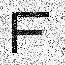

# Binary Image Restoration with a Pairwise Markov Random Field

An end-to-end notebook that restores a corrupted binary image by minimizing a
pairwise Markov random field (MRF) energy. The implementation makes the model's
assumptions visible and compares practical strategies for escaping poor local
minima.

## Approach

The latent pixel labels \(x_i\in\{-1,+1\}\) balance neighborhood smoothness and
fidelity to the noisy observation \(y_i\):

\[
E(x,y)=h\sum_i x_i-\beta\sum_{\langle i,j\rangle}x_ix_j-\eta\sum_i x_iy_i.
\]

The notebook implements coordinate descent, randomized update order, multiple
restarts, and simulated annealing. Intermediate images make it possible to
inspect where each optimizer succeeds or fails.

## Quick start

```bash
git clone https://github.com/takakhoo/markov-image-restoration.git
cd markov-image-restoration
python -m venv .venv
source .venv/bin/activate  # Windows: .venv\Scripts\activate
python -m pip install -r requirements.txt
jupyter lab "Markov Restoration.ipynb"
```

[Open the executed notebook](Markov%20Restoration.ipynb)

Run from the repository root so the notebook can resolve its relative
`figures/` paths.

## Example output

| Clean reference | 10% pixel corruption | MRF restoration |
| --- | --- | --- |
|  |  |  |

## Repository layout

- `Markov Restoration.ipynb` — model, optimization experiments, and outputs
- `figures/` — clean, corrupted, intermediate, and restored images

## Verification

The notebook was executed end to end on September 16, 2026. It regenerated the
corrupted inputs, optimization traces, and restored-image outputs without cell
errors.

## Scope

This project is a transparent educational implementation for binary images. It
is not intended to compete with modern learned image-restoration systems.
