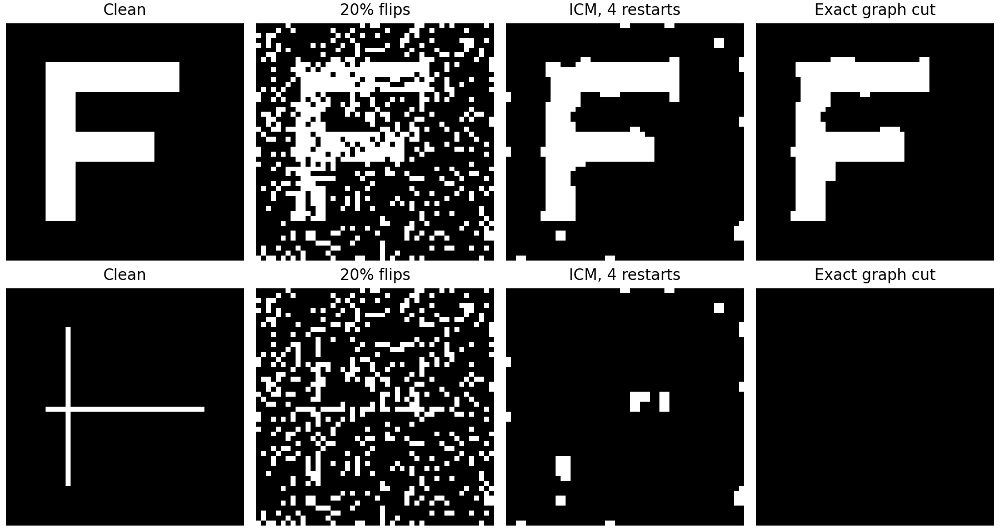

# Binary Image Restoration with a Pairwise Markov Random Field

An end-to-end notebook that restores a corrupted binary image by minimizing a
pairwise Markov random field (MRF) energy. The implementation makes the model's
assumptions visible and compares practical strategies for escaping poor local
minima.

## Reproducible comparison: local search vs. exact graph cut



```bash
git clone https://github.com/takakhoo/markov-image-restoration.git
cd markov-image-restoration
python -m venv .venv
source .venv/bin/activate
python -m pip install -r requirements-reproduce.txt
python -m unittest -v
python experiment.py --output results
```

CPU only, Python 3.9–3.12, no external data. The experiment generates both
images, tests 10%, 20%, and 30% independent pixel flips across seeds 7, 19, and
41, and writes a plot plus [all 54 scored cases](results/metrics.json).
The model weights are fixed (`h=0`, `beta=0.8`, `eta=1`), not tuned on clean
test targets. Randomized ICM uses four restarts selected by **observed MRF
energy only**. Clean images are available only to the final scoring function.

### Measured results at 20% corruption

Means over all three seeds:

| Image | Method | Pixel accuracy | Foreground IoU | Balanced accuracy |
|---|---|---:|---:|---:|
| Thick shape | Noisy input | 80.19% | 0.424 | 80.57% |
| Thick shape | ICM, four restarts | 96.79% | 0.842 | 96.16% |
| Thick shape | Exact graph cut | **98.74%** | **0.934** | **98.64%** |
| Thin lines | Noisy input | 80.19% | 0.099 | 80.05% |
| Thin lines | ICM, four restarts | 95.85% | 0.119 | 59.04% |
| Thin lines | Exact graph cut | 97.16% | **0.000** | **49.95%** |

The failure case matters: a strong smoothness prior removes thin details.
Pixel accuracy looks excellent because most pixels are background, even when
the foreground disappears. **An exact energy minimum is not necessarily the
best reconstruction.** IoU and balanced accuracy expose that mismatch.

The graph-cut solver reaches the global minimum of this binary attractive
pairwise model (`beta >= 0`). Regression tests compare it with exhaustive search
on every 2×2 observation under three bias values, verify local energy deltas,
check monotone ICM energy, and confirm reproducibility without mutating inputs.
CI runs the same tests and experiment and uploads fresh result artifacts.

### Corrections to the original notebook

- Restarts used to be selected using clean-image accuracy, leaking the answer.
  They are now selected by MRF energy; accuracy is reported afterward.
- Randomized updates and annealing now have a fixed seed.
- The saved denoised image now uses the actual selected restoration, not the
  unchanged initial image.
- The notebook was re-executed after the fixes. Historical percentages should
  not be compared directly with the corrected, non-oracle selection procedure.

## Approach

The latent pixel labels \(x_i\in\{-1,+1\}\) balance neighborhood smoothness and
fidelity to the noisy observation \(y_i\):

\[
E(x,y)=h\sum_i x_i-\beta\sum_{\langle i,j\rangle}x_ix_j-\eta\sum_i x_iy_i.
\]

The notebook implements coordinate descent, randomized update order, multiple
restarts, and simulated annealing. Intermediate images make it possible to
inspect where each optimizer succeeds or fails.

## Quick start

```bash
git clone https://github.com/takakhoo/markov-image-restoration.git
cd markov-image-restoration
python -m venv .venv
source .venv/bin/activate  # Windows: .venv\Scripts\activate
python -m pip install -r requirements.txt
jupyter lab "Markov Restoration.ipynb"
```

[Open the executed notebook](Markov%20Restoration.ipynb)

Run from the repository root so the notebook can resolve its relative
`figures/` paths.

## Example output

| Clean reference | 10% pixel corruption | MRF restoration |
| --- | --- | --- |
|  |  |  |

## Repository layout

- `Markov Restoration.ipynb` — model, optimization experiments, and outputs
- `figures/` — clean, corrupted, intermediate, and restored images

## Verification

The corrected notebook runs end to end. Five automated tests additionally
check the extracted solver and exact baseline; the separate CLI regenerates
every reported case without a notebook server.

## Scope

This project is a transparent educational implementation for binary images. It
is not intended to compete with modern learned image-restoration systems.
